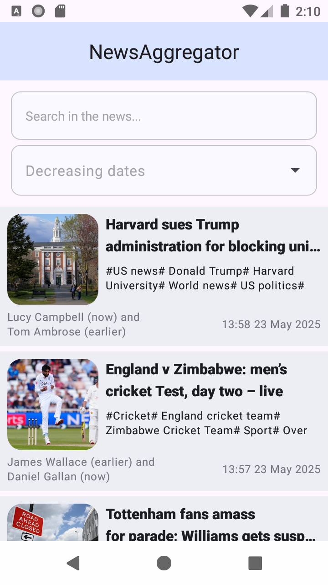
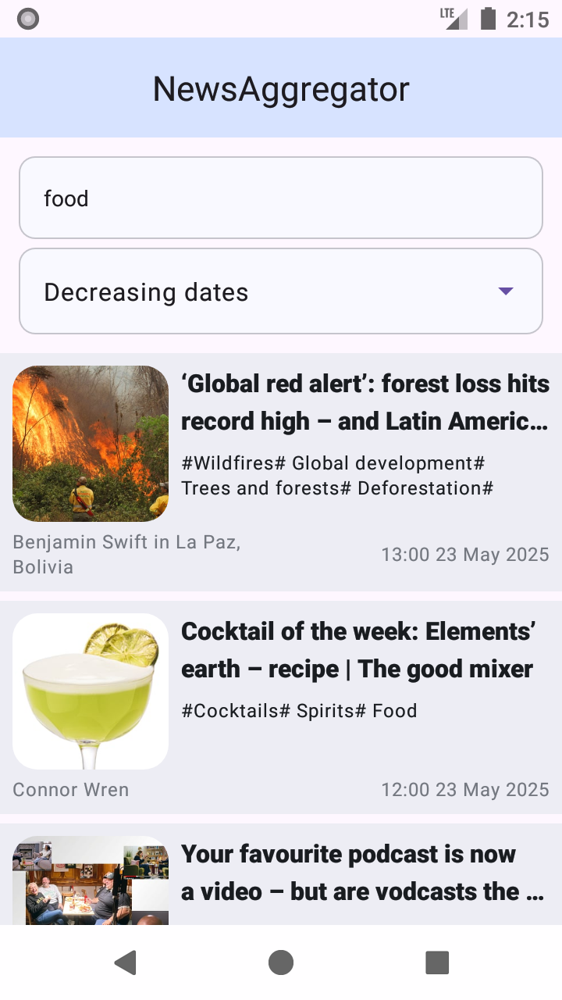
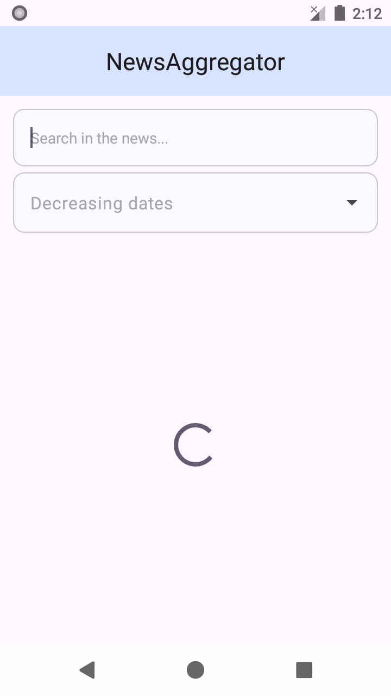
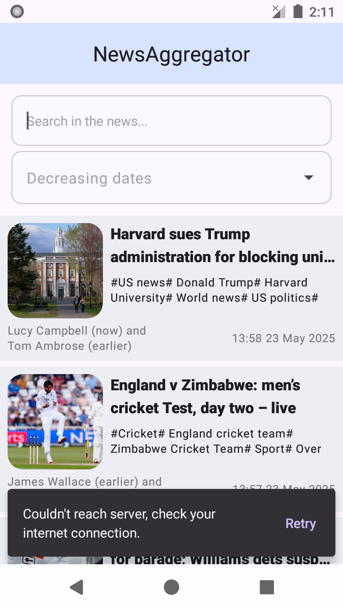
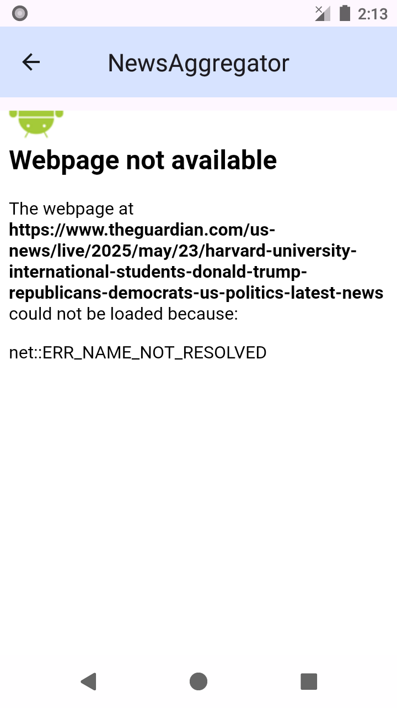

# Тестовое задание для Android разработчика. Новостное приложение.

## Описание

Было реализовано два экрана: экран со списком новостей, с функцией поиска и сортировки новостей.  
Экран соответствует фукнкциональным и нефункциональным требованиям.  
Загрузка данных происходит из внешнего API https://www.theguardian.com/international/rss.
При разработке архитектуры было решено следовать правилам Clean Architecture.  
Используемый архитектурный паттерн: MVVM.  
Приложение поддерживает светлую и тёмную темы. 

## Стек технологий

- Язык: kotlin
- Работа с сетью: Retrofit, OkHttp
- Многопоточность: Kotlin Coroutines/Flow
- View: XML
- Сериализаторы: Kotlinx Serialization
- Навигация: Fragment
- Архитектура: MVVM
- Загрузка изображений: Glide

## Скриншоты работы приложения

### Список новостей

### Поиск по новостям

### Сортировка по возрастанию даты

### Состояние загрузки

### Сообщение об ошибке

  
  

